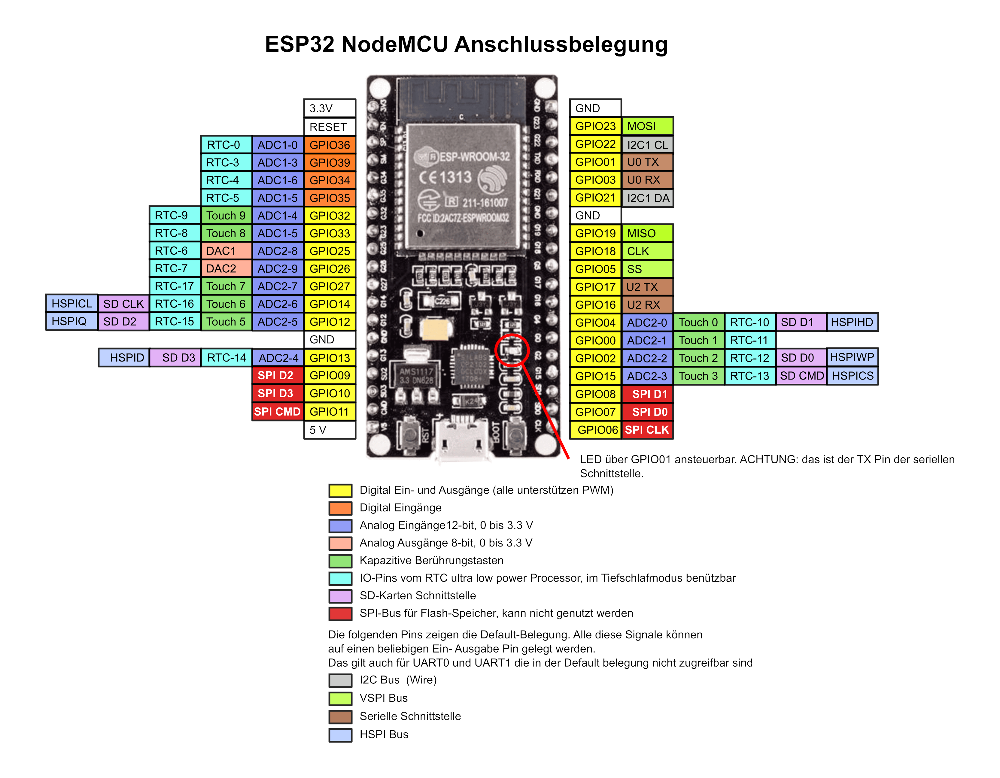

# Geiger Counter

## Hardware Setup
- 1× Geiger Counter
- 1× [ESP32 Dev Board](https://www.az-delivery.de/products/esp32-developmentboard)
- 1× LCD Display with I2C Interface.
- 1× DS1307 RTC Module. The one used in this project is the one from [Elegoo Sensor Kit](https://www.elegoo.com/products/elegoo-37-in-1-sensor-kit)
- 1× SD Card Module + SD Card, notice that the SD Card must be formatted as FAT with max. 2GB partition.
- 1× Push Button
- 1× NeoPixel programmable LED
- 1× 1 MΩ Resistor (for the Geiger Counter)
- 1× 10 kΩ Potentiometer (for the LCD Display backlight)

## Wiring
- Geiger Counter:
  - GPIO16 - Signal
  - 5V - VCC
  - GND - GND
- LCD Display:
  - GPIO22 - CL
  - GPIO21 - DA
  - 5V - VCC
  - GND - GND
- DS1307 RTC Module:
  - GPIO22 - CL
  - GPIO21 - DA
  - 5V - VCC
  - GND - GND
- SD Card Module:
  - GPIO05 - SS/CS
  - GPIO18 - CLK
  - GPIO19 - MISO
  - GPIO23 - MOSI
  - 5V - VCC
  - GND - GND
- Button:
  - GPIO15 - Save button
  - GND - Save button
- NeoPixel LED:
  - GPIO02 - Data
  - 5V - VCC
  - GND - GND
- 1 MΩ Resistor:
  - GPIO16 - GND
- 10 kΩ Potentiometer
  - LCD jumper - Potentiometer first pin
  - LCD jumper - Potentiometer middle pin

## ESP32 Pinout

