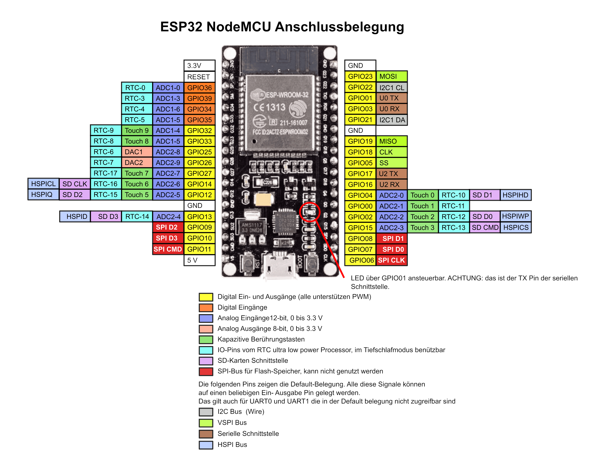

# Geiger Counter v1.1

## Geiger Counter Tube Specifications

- **Type:** J305βγ
- CPM to µSv/h conversion factor: **0.00812** (?)

## Calculating the CPM to µSv/h conversion formula

μSv/h = CPM × conversion factor

## Hardware Setup

- 1× Geiger Counter
- 1× [ESP32 Dev Board](https://www.az-delivery.de/products/esp32-developmentboard)
- 1× [LCD TFT Display 320×240](https://www.az-delivery.de/products/2-8-zoll-lcd-tft-touch-display), ILI9341 driver, SPI interface
- 1× DS1307 RTC Module. The one used in this project is the one from [Elegoo Sensor Kit](https://www.elegoo.com/products/elegoo-37-in-1-sensor-kit)
- 1× SD Card Module + SD Card, notice that the SD Card must be formatted as FAT with max. 2GB partition.
- 1× Push Button
- 1× NeoPixel programmable LED
- 1× 1 MΩ Resistor (for the Geiger Counter)

## Wiring

- Geiger Counter:
  - GPIO36 (SP) - Signal
  - 5V - VCC
  - GND - GND
- TFT Display:
  - GPIO25 - CS
  - GPIO32 - DC
  - GPIO33 - RST
  - GPIO23 - MOSI
  - GPIO19 - MISO
  - GPIO18 - CLK
  - 5V - LED
  - 5V - VCC
  - GND - GND
- DS1307 RTC Module:
  - GPIO22 - CL
  - GPIO21 - DA
  - 5V - VCC
  - GND - GND
- SD Card Module:
  - GPIO05 - SS/CS
  - GPIO18 - CLK
  - GPIO19 - MISO
  - GPIO23 - MOSI
  - 5V - VCC
  - GND - GND
- Button:
  - GPIO15 - Save button
  - GND - Save button
- NeoPixel LED:
  - GPIO02 - Data
  - 5V - VCC
  - GND - GND
- 1 MΩ Resistor:
  - GPIO36 (SP) - GND

## ESP32 Pinout

## Libraries

- [Adafruit_ILI9341](https://github.com/adafruit/Adafruit_ILI9341) - Adafruit ILI9341 Arduino Library.
- [Adafruit_NeoPixel](https://github.com/adafruit/Adafruit_NeoPixel) - Adafruit NeoPixel Library.
- [RTClib](https://github.com/adafruit/RTClib) - Adafruit fork of JeeLab's fantastic real time clock library for Arduino.
